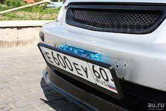
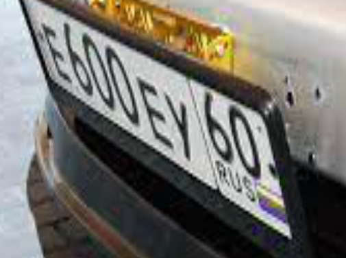
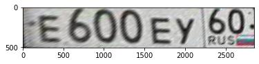

# Overview

This repository contains source code for cars' plates detection and recognition, which can be applied for both video and image data.
Here is an example:

On the first stage we have detect() function working to put bounding box of the plate and crop the result:

  

On the next stage we use adjust_perspective() to bring plate back to straight look:

Detected license plate Number is:E600EY.

# Technical details:

* YOLO v4 is used as a detector pretrained on Car plates dataset (you can find it in ./data folder).
* We use trained Net to segment number in order to find the nodes.
* 3rd stage includes OpenCV algo to adjust perspective. 
* Last stage consits of using any library (like pytesseract) to convert straight plate image into string.

# Usage

5. Done!

## Other resources
https://github.com/experiencor/keras-yolo3
